# Mycraft

Mycraft is our Computer Graphics curriculum design based on modern OpengGL. 

It's a clone of Minecraft mainly written in C++ and we have implemented both Mac version and iOS version for it.

Refer to [Mobilecraft](https://github.com/Clapeysron/MobileCraft) for more information about the iOS version.

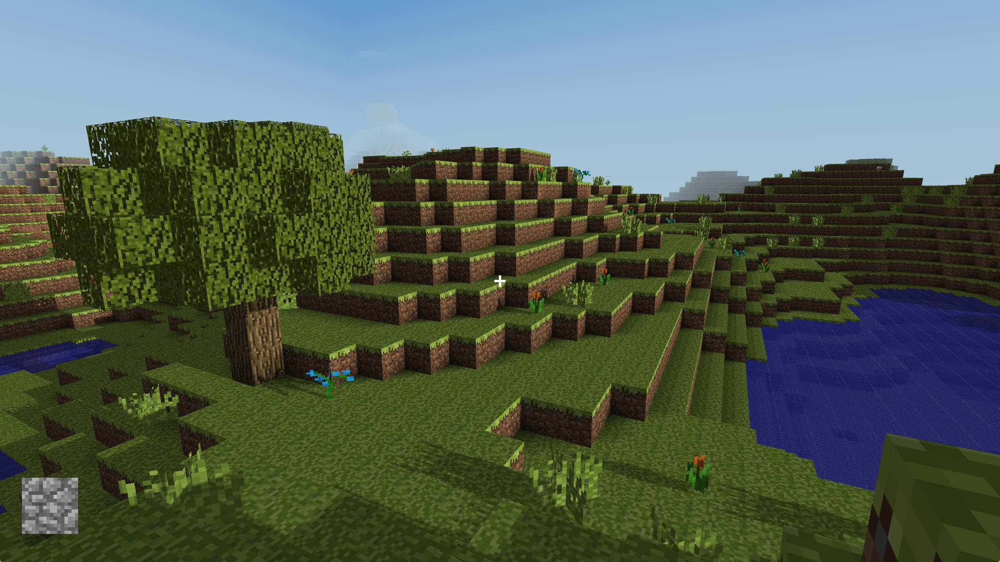

## Features

### Render

-   Original block textures from Minecraft
-   Simple realtime shadow mapping
-   Corner shadow to simulate SSAO effect
-   Brightness-diffusion of point light such as Torch & Glowstone
-   Time pass effect with Sunrise / Sunset / Moon & Starry sky
-   Breaking aniamtion & highlight of the block selected
-   Transparent / translucent block such as water & glass
-   Simple on-ground and below-water gravity engine 
-   Jitter perspective to simulate running effect
-   Underwater visual effects
-   Fog that hides far away chunks

### Data

-   Terrain & cloud generation with perlin noise
-   Random generation of Flora
-   Hidden surface removal & invisible subchunk removal
-   frustum culling
-   Enclosed space detection
-   Corner shadow & brightness calculation
-   Adjustable game settings in `src/game_settings.h`
-   Map storage not done yet :(

## Build

### Install glfw & glew & assimp

Install glfw & glew & assimp with [Homebrew](http://brew.sh/).

	brew install glfw
	brew install glew
	brew install assimp
Then add lib in Click **Project Icon in Left Navigator** - **Build Phases** - **Link Binary With Libraries** - Add `libGLFW.X.X.dylib` & `libGLEW.X.X.X.dylib` & `libassimp.X.X.X.dylib` then remove the not-found(red) lib in left navigator.

### Install glad

Install [glad](https://github.com/Dav1dde/glad) from [online-pack](http://glad.dav1d.de/) following the tutorial from [learnopengl - Creating a window](https://learnopengl.com/#!Getting-started/Creating-a-window).

Choose OpenGL 3.3 and **Core Profile** then generate.

Then move header folder glad / KHR to `/usr/local/include`

### Set XCode working directory

Set your working directory in **XCode** - **Product** - **Scheme** - **Edit Scheme** - **Run** - **Working Directory** to `{Where Your Place}/Mycraft/Mycraft`

### Close shadow mapping if without independent graphics

For Macbook without discrete graphics, the game may lose its fluency greatly with the shadow on. You can comment out line 13 in `/src/Render.cpp` to ban it.

    //#define SHADOW_MAPPING

### Run

Just click run to get the game started

## Game Control

-   Press WASD to move and press Space to jump
-   Long press the left mouth button to break the selected block 
-   Click the right mouth button to place a block
-   Use space to fly and F to fall in god mode
-   ← & → to switch blocks for placing
-   ↑ & ↓ to switch options now choose (default is fov(1) )
-   1-5 to switch options. 
    -   1 fov  (↑- ↓+)
    -   2 cursor escape (↑disabled ↓escaped)
    -   3 game mode (↑god mode ↓normal mode)
    -   4 perspective (↑first person ↓third person)
    -   5 zoom in thid-person perspective (↑zoom in ↓zoom out)
-   Change all game settings in `src/game_settings.h`

## Architecture Design

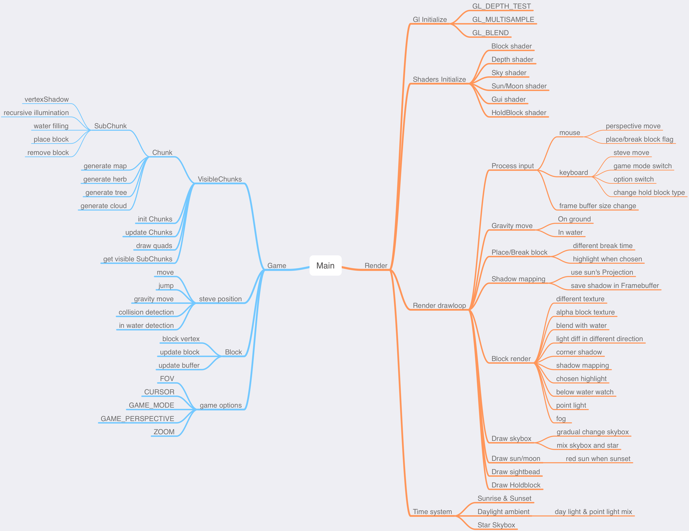

## Reference

Tribute to best [Minecraft](https://minecraft.net).

Modern OpenGL example code from [learnopengl](https://learnopengl.com) and  [learnopengl-cn](https://learnopengl-cn.github.io) (Perfect chinese version :)

Skybox texture & Steve model sources from [Craft](https://github.com/fogleman/Craft).

## Screenshots

### Steve & Alex object

### Original Textures

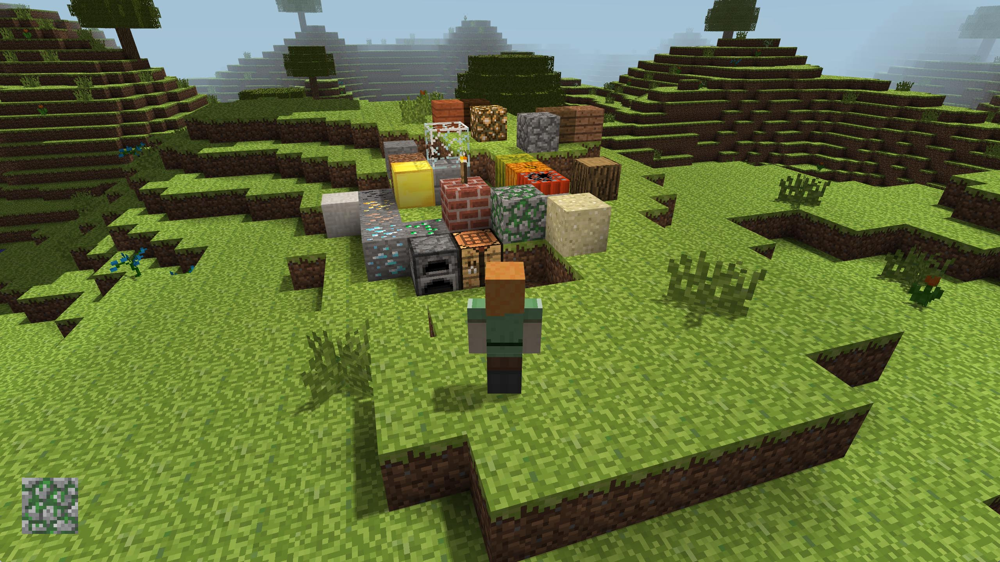

### Sunset

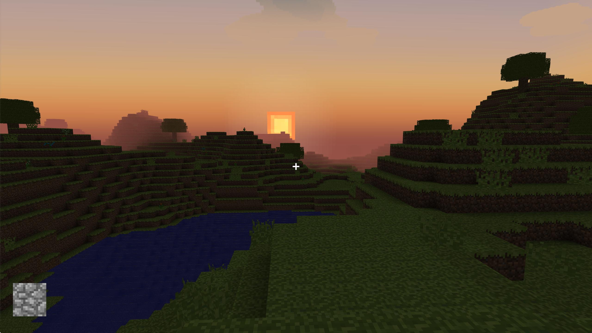

### Point Light

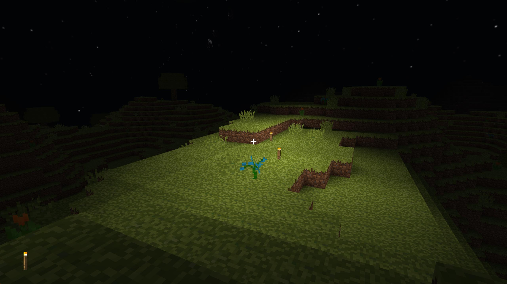

### In-water Point Light

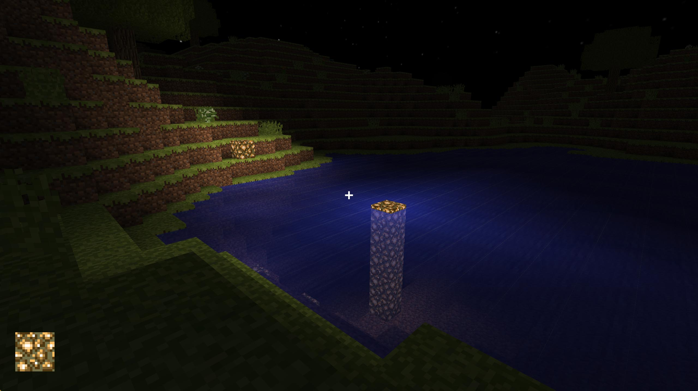

### Realtime Shadow Mapping

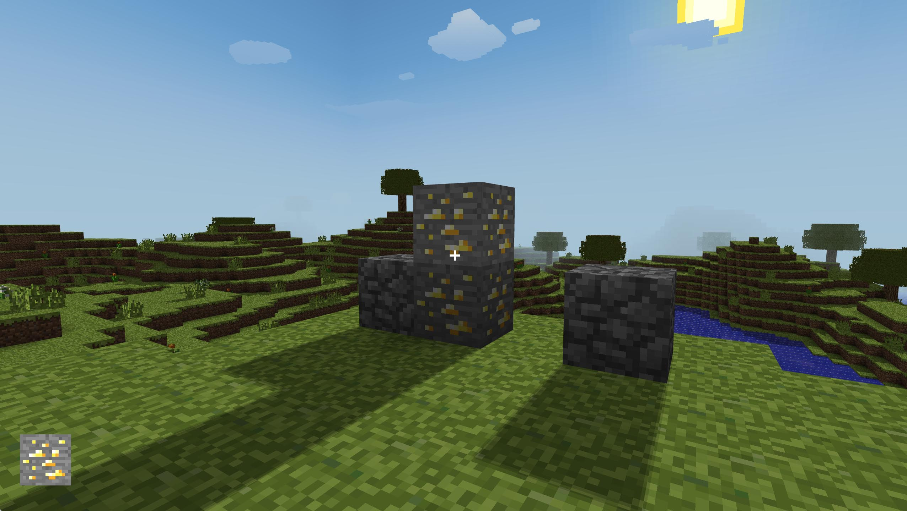

### Underwater Visual Effects

### Fog

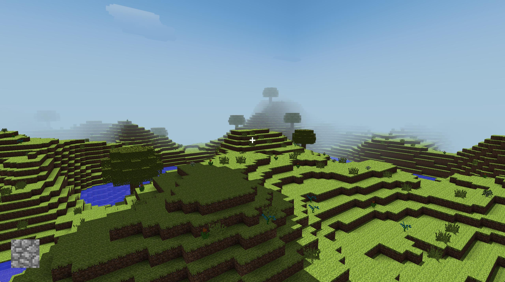

### Moon

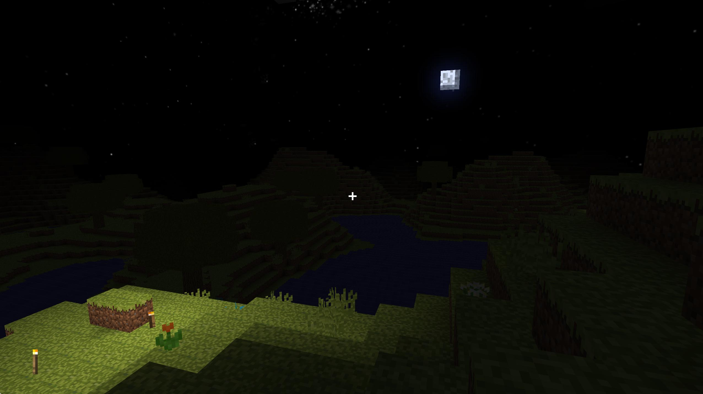

### Breaking Animation

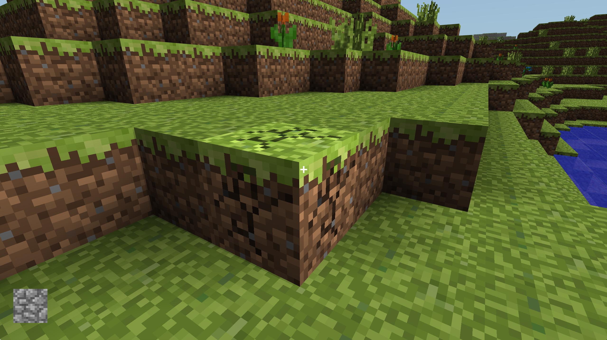

### Ugly House by Author

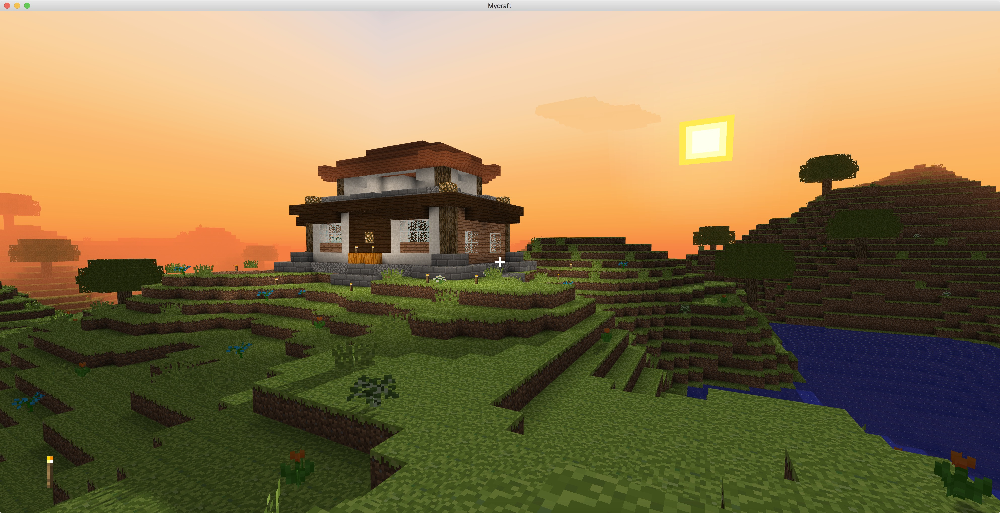

### iOS MobileCraft Screenshot

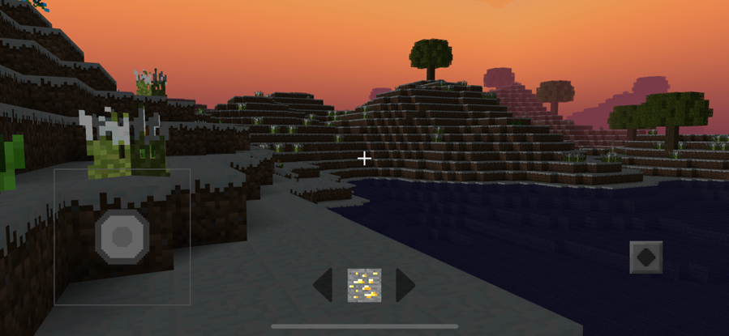
