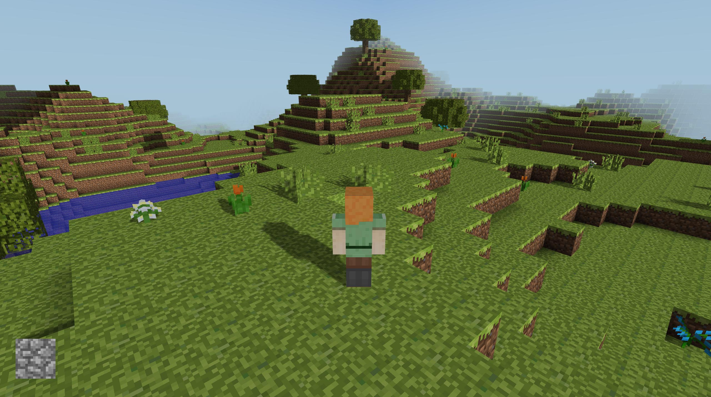
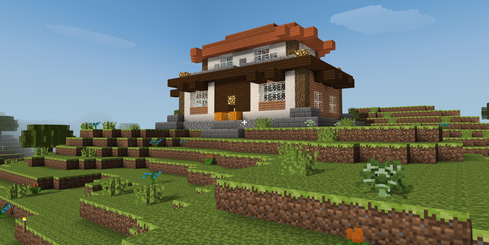

# Mycraft

Mycraft is a learning-OpenGL project completed in ZJU computer graphics course.

It's a Minecraft clone with lighting effects based on modern OpengGL on MacOS use C++ and build with XCode.

Its iOS transplant Version [Mobilecraft](https://github.com/Clapeysron/MobileCraft) use most of the data part c++ code in this project and use GLKit to render and Objective-C for bridging.

## Features

### Render

-   Original block textures from Minecraft
-   Simple realtime shadow mapping
-   Corner shadow to simulate SSAO effect
-   Point light with smooth diffusion from Torch / Glowstone
-   Time pass effect with Sunrise / Sunset / Moon & Starry sky
-   Animation when break a block / Highlight when choose a block
-   Transparent / translucent block like water / glass
-   Simple gravity engine for on-the-ground and below-water
-   Jitter perspective to simulate running effect
-   Underwater visual effects
-   Fog effect for blocks far away

### Data

-   Infinite random map generation use perlin noise
-   Trees / Flowers / Grass / Cloud / Lake random generation
-   Visible face culling and frustum culling for faster rendering
-   Closed space testing and neighboring visible chunks culling
-   Corner shadow / Point light effect generate and update
-   Adjustable game settings in `src/game_settings.h`
-   Map storage not done yet :(

## Build

### Install glfw

Use [Homebrew](http://brew.sh/) to install glfw.

	brew install glfw

### Install glad

Install [glad](https://github.com/Dav1dde/glad) form its [online-pack](http://glad.dav1d.de/) follow tutorial from [learnopengl - Creating a window](https://learnopengl.com/#!Getting-started/Creating-a-window).

### Set XCode working directory

Set your working directory to project folder in XCode - Product - Scheme - Edit Scheme - Run - Working Directory - Use `{Where Your Place}/Mycraft/Mycraft`

### Close shadow mapping if without independent graphics

If you use Macbook without independent graphics, the shadow mapping is too heavy for the integrated graphics just comment out the line 13 in `/src/Render.cpp`

    //#define SHADOW_MAPPING

### Run

Just click run to get the game started

## Game Controls

-   WASD to move and Space to jump
-   Press mouse left to break and click mouse right to place block
-   Use space to fly and F to fall in god mode
-   ← & → to switch blocks for placing
-   ↑ & ↓ to switch options now choose (default is fov(1) )
-   1-5 to switch options. 
    -   1 fov  (↑- ↓+)
    -   2 cursor escape (↑disabled ↓escaped)
    -   3 game mode (↑god mode ↓normal mode)
    -   4 perspective (↑first person ↓third person)
    -   5 zoom in thid-person perspective (↑zoom in ↓zoom out)
-   Change all game settings in `src/game_settings.h`

## Architecture Design

## Reference

Tribute to best [Minecraft](https://minecraft.net).

Modern OpenGL example codes from [learnopengl](https://learnopengl.com) and  [learnopengl-cn](https://learnopengl-cn.github.io) (Perfect chinese version :)

Skybox texture & Steve model sources from [Craft](https://github.com/fogleman/Craft).

## Screenshots

### Steve & Alex object

### Original Textures

### Sunset

### Point Light

### In-water Point Light

### Realtime Shadow Mapping

### Underwater Visual Effects

### Fog

### Moon

### Breaking Animation

### Ugly House by Author

### iOS MobileCraft Screenshot

